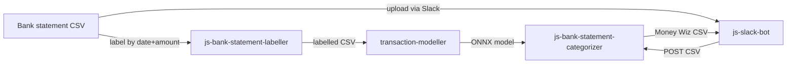

# my-accountant 👨‍💻

A homemade toolchain to help me manage my finances 🏦.

## Pipeline



## Supported banks

- ASB
- ANZ
- Kiwibank

## Components

- [`js-bank-statement-labeller`](packages/js-bank-statement-labeller/README.md) 🏷️ — labels transactions by matching against an existing ledger
- [`js-bank-statement-categorizer`](packages/js-bank-statement-categorizer/README.md) 🔮 — Express API that runs ML inference and returns a Money Wiz CSV
- [`js-slack-bot`](packages/js-slack-bot/README.md) 🤖 — Slack bot that drives the pipeline end-to-end
- [`transaction-modeller`](packages/transaction-modeller/README.md) 🧠 — Jupyter environment for training and exporting the ONNX model

## Setup

```sh
yarn install
```

## Development

```sh
# Categorizer service (port 3001)
yarn workspace js-bank-statement-categorizer dev

# Slack bot (port 3002)
yarn workspace js-slack-bot dev
```

See each package's README for further usage and configuration details.
